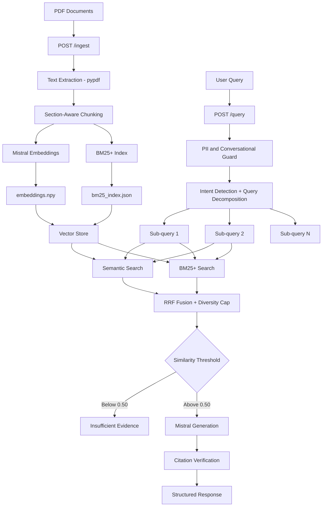
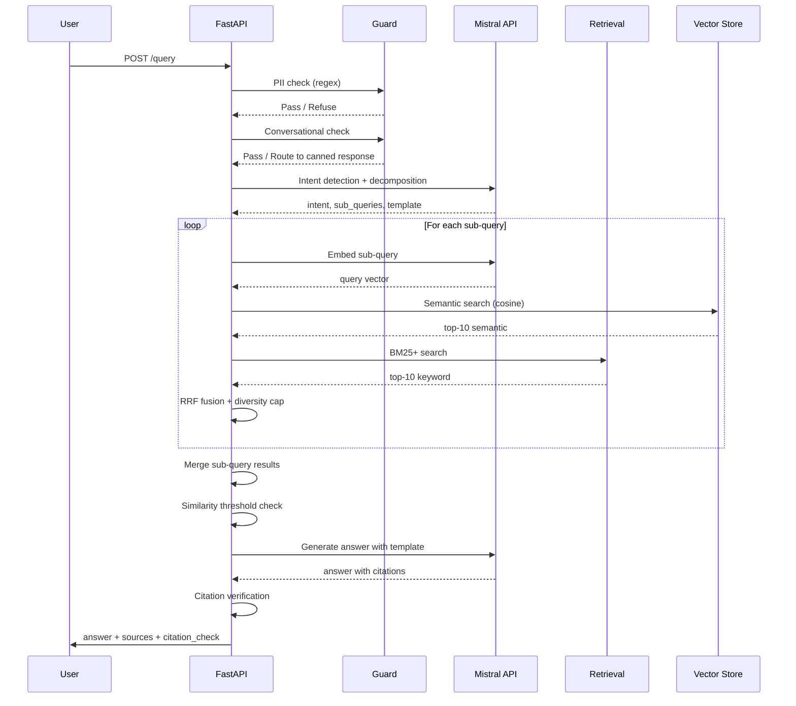

# Insurance RAG Pipeline

An insurance policy Q&A system that ingests PDF documents and answers questions using hybrid retrieval and Mistral AI. Built for claims adjusters who need to query base policies, endorsements, state amendments, and declarations pages — the system handles cross-document reasoning where an answer requires combining information from multiple policy documents simultaneously.

---

## System Architecture



---

## Design Decisions

### Chunking Strategy

Insurance policy documents have a well-defined hierarchical structure — sections, coverages, exclusions, and numbered clauses. Splitting on fixed token counts ignores this structure entirely and creates a critical problem: if a chunk boundary falls mid-clause, the section number gets separated from the clause text. A retriever searching for Section 7.3 finds a chunk that contains the number but not the rule, or the rule but not the number. Section-aware chunking solves this by first splitting on detected section headers (SECTION I, Coverage A, 7.3, AGREEMENT, DEFINITIONS etc.) so each chunk represents a complete legal unit. The cross-reference metadata extracted per chunk — section numbers and form codes mentioned in the text — enables cross-document retrieval without a second pass.

When no section headers are detected (declarations pages, endorsement boilerplate), the pipeline falls back to fixed 500-token chunks with 15% overlap. The overlap is implemented with word-boundary awareness — the split point walks back to the nearest space character rather than cutting mid-word, which would produce meaningless tokens and degrade embedding quality.

### Hybrid Search: BM25+ and Semantic

Semantic search alone is insufficient for insurance documents. A query like "does endorsement NX-END-02 override Section 7.3?" contains two exact identifiers — NX-END-02 and Section 7.3 — that are critical for precision retrieval. The embedding of NX-END-02 sits very close to NX-END-01, NX-END-03, and other similar codes in vector space. A cosine similarity search may return the wrong endorsement. BM25+ catches this because it scores based on exact term frequency — NX-END-02 in the query matches NX-END-02 in the document exactly, no blurring.

BM25+ was chosen over standard BM25 because the corpus has variable-length chunks — base policy sections run to 500 tokens while endorsement chunks average 150 tokens. Standard BM25 has a known lower-bound deficiency: a long chunk that contains a query term once can score the same as a short chunk that does not contain it at all. The delta parameter in BM25+ (set to 1.0) ensures every matching chunk receives at least a minimum positive score, making long base policy chunks compete fairly against short endorsement chunks. BM25L was evaluated and rejected — it is designed for whole-document retrieval over very long documents, not for pre-chunked corpora where chunk lengths are already normalised.

### Query Decomposition

A single query rewrite is insufficient for cross-document reasoning. The question "is water damage from frozen pipes covered if the house was vacant for 65 days?" requires evidence from at least three document types: the base policy vacancy exclusion, any endorsement that modifies that exclusion, and the declarations page confirming which endorsements are attached. A single rewritten query will be pulled toward the most semantically dominant document and miss the others. Query decomposition solves this by making one Mistral call that produces 2-4 targeted sub-queries, each tagged with a doc_type (base_policy, endorsement, declarations, amendment). Each sub-query is embedded and retrieved independently against its target document category, then results are merged. This turns a single-shot retrieval into a structured multi-hop search.

### Reciprocal Rank Fusion

RRF combines the ranked results from semantic search and BM25+ without requiring score normalisation. Adding raw BM25+ scores to cosine similarities directly would be meaningless — the two scales are incomparable. RRF instead uses only rank positions: each chunk receives a score of weight / (k + rank) from each result list it appears in, and scores are summed. Chunks appearing in both lists get a natural boost. k=60 is the standard constant from the RRF literature — it dampens the outsized advantage of rank-1 over rank-2, making the fusion robust to ties. BM25+ results receive a weight of 1.2 versus 1.0 for semantic results because insurance queries disproportionately contain exact identifiers where BM25+ is more reliable.

### Vector Storage

Embeddings are stored as a numpy float32 matrix (1143 × 1024) and chunk metadata as a JSON file. This satisfies the no-third-party-vector-database constraint and requires zero operational overhead. At 1143 chunks, exact cosine search over the entire matrix takes under 5ms — the O(N) complexity is irrelevant at this scale. The index is loaded once at server startup into memory using FastAPI lifespan events and kept as read-only arrays, making concurrent queries safe without locking. For corpora exceeding 100k chunks, np.memmap would allow the matrix to remain on disk while querying subsets without loading the full float matrix into RAM.

### Similarity Threshold

The similarity threshold of 0.50 is calibrated for mistral-embed on insurance legal text. In practice, chunks genuinely relevant to a query score between 0.55 and 0.75 cosine similarity, while unrelated chunks from the same domain score below 0.40. The 0.50 threshold sits cleanly in the gap. When no chunk exceeds this threshold, the system returns an explicit refusal message rather than generating an answer from weak evidence — a hallucinated coverage determination is more dangerous than a non-answer in insurance claims adjustment.

---

## Query Flow



---

## Bonus Features Implemented

| Feature | Implementation |
|---------|---------------|
| No external RAG libraries | All retrieval implemented from scratch using numpy and pure Python |
| No third-party vector database | Embeddings stored as numpy matrix, metadata as JSON |
| BM25+ from scratch | Custom tokenizer preserving legal identifiers, BM25+ formula with delta=1.0 |
| Citation verification | Post-generation regex parses chunk IDs, verified against retrieved set in Python |
| Insufficient evidence refusal | Cosine similarity threshold 0.50 — returns explicit refusal message |
| Answer shaping | 5 templates: coverage_determination, limit_lookup, override_conflict, definition, general |
| PII refusal | Regex detection of SSN, phone, email, credit card before any API call |
| Query decomposition | Single Mistral call decomposes query into 2-4 doc_type-targeted sub-queries |
| Diversity cap | Max 3 chunks per doc_type prevents semantic collapse into single document type |
| Security | PII filter before API calls, allow_pickle=False on numpy load, try/finally temp cleanup |

---

## Project Structure

```
Insurance_rag/
├── app/
│   └── main.py              # FastAPI app — /health, /ingest, /query endpoints
├── src/
│   ├── ingestion/
│   │   └── pipeline.py      # PDF extraction, chunking, embedding, BM25+ index
│   ├── retrieval/
│   │   └── pipeline.py      # Semantic search, BM25+ search, RRF, diversity cap
│   └── generation/
│       └── pipeline.py      # Intent detection, query decomposition, generation, citation verification
├── ui/
│   └── chat.py              # Streamlit chat interface
├── data/
│   └── raw_docs/            # PDF knowledge base (19 documents)
├── vector_store/            # embeddings.npy, metadata.json, bm25_index.json
└── scripts/
    ├── generate_docs.py     # Generates synthetic insurance PDFs via Mistral API
    └── convert_to_pdf.py    # Converts generated text to PDF using ReportLab
```

---

## How to Run

### Prerequisites
- Python 3.10+
- Mistral AI API key — get one free at [console.mistral.ai](https://console.mistral.ai)

### Setup

```bash
git clone https://github.com/rohit-iipeml/insurance-rag.git
cd insurance-rag
python -m venv venv
source venv/bin/activate
pip install -r requirements.txt
```

Add your Mistral API key to `.env`:

```
MISTRAL_API_KEY=your_key_here
```

### Ingest Documents

```bash
# Terminal 1 — start the API server
uvicorn app.main:app --host 0.0.0.0 --port 8000

# Terminal 2 — trigger ingestion of existing PDFs
curl -X POST http://0.0.0.0:8000/ingest
```

Or upload your own PDFs:

```bash
curl -X POST http://0.0.0.0:8000/ingest \
  -F 'files=@your_policy.pdf'
```

### Run the Chat UI

```bash
streamlit run ui/chat.py
```

Open [http://localhost:8501](http://localhost:8501) in your browser.

## Running the Frontend

### Prerequisites
- Node.js 18+

### Setup
```bash
cd ui/react_app
npm install
npm run dev
```

The React app runs on http://localhost:5173 and expects the FastAPI backend running at http://localhost:8000. Start the backend first.

### API Endpoints

| Endpoint | Method | Description |
|----------|--------|-------------|
| /health | GET | Health check |
| /ingest | POST | Ingest PDFs — upload files or use existing docs in data/raw_docs/ |
| /query | POST | Query the knowledge base |

---

## Libraries and Software Used

| Library | Version | Purpose |
|---------|---------|---------|
| [FastAPI](https://fastapi.tiangolo.com/) | 0.136.0 | REST API framework |
| [Uvicorn](https://www.uvicorn.org/) | 0.44.0 | ASGI server |
| [Mistral AI](https://docs.mistral.ai/) | 1.2.5 | LLM and embeddings API |
| [pypdf](https://pypdf.readthedocs.io/) | 6.10.2 | PDF text extraction |
| [numpy](https://numpy.org/doc/) | 2.4.4 | Vector storage and cosine similarity |
| [Streamlit](https://docs.streamlit.io/) | 1.56.0 | Chat UI |
| [python-dotenv](https://pypi.org/project/python-dotenv/) | 1.2.2 | Environment variable management |
| [ReportLab](https://docs.reportlab.com/) | 4.4.10 | PDF generation for synthetic documents |

---

## Known Limitations and Future Improvements

- **Neighbor chunk inclusion** — retrieving adjacent chunks would help when answers span section boundaries
- **Incremental ingestion** — currently re-embeds entire corpus on each ingest call; a document hash check would skip unchanged files
- **Cross-encoder reranking** — a second-stage reranker would improve precision at the cost of latency
- **Memory-mapped numpy** — for corpora exceeding 100k chunks, np.memmap would reduce memory footprint
- **Multi-tenant support** — user-level document isolation not yet implemented
